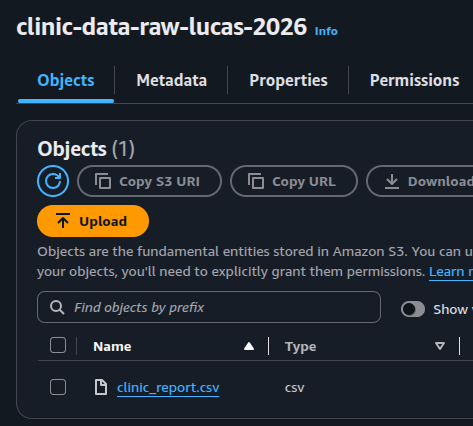
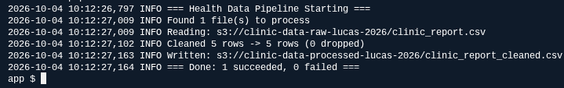
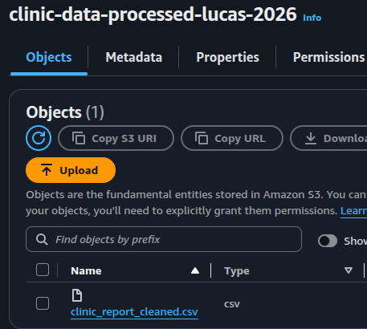
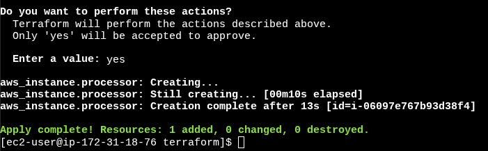
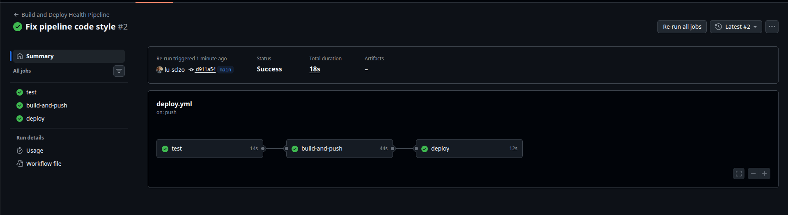
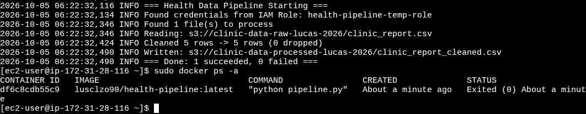
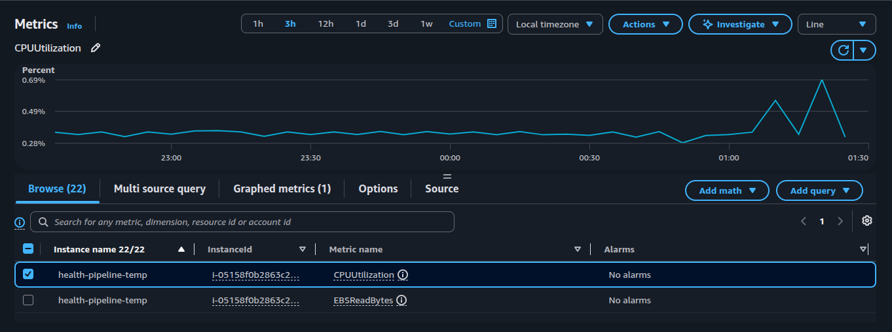
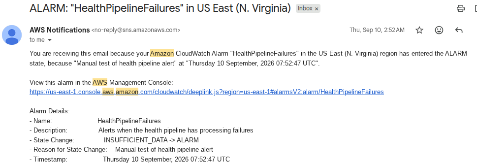

# AWS Health Data Pipeline

## Project Overview

This project simulates a secure, cloud-based healthcare data processing pipeline using Amazon Web Services (AWS). It demonstrates how synthetic clinic records can be ingested, validated, transformed, and stored using cloud infrastructure, containerization, Infrastructure as Code (IaC), and CI/CD automation.

The pipeline uses Amazon S3 for data storage, Python and Pandas for ETL processing, Docker containers running on Amazon EC2, Terraform for infrastructure provisioning, and GitHub Actions for automated testing and deployment.

The project also incorporates IAM-based access controls, S3 encryption and versioning, CloudWatch monitoring, and Amazon SNS notifications.

**All healthcare records used in this project are synthetic. No real patient information was processed.**

## Architecture


### Data Processing Flow

```text
Synthetic Clinic Data
        |
        v
Amazon S3 (Raw Bucket)
        |
        v
Amazon EC2 + Docker
        |
        v
Python / Pandas ETL
        |
        v
Amazon S3 (Processed Bucket)
```

CloudWatch provides monitoring, while CloudWatch alarms and Amazon SNS support failure notifications. Terraform manages AWS infrastructure, and GitHub Actions automates the application build and deployment workflow.

## Technologies Used

| Category | Technologies |
|---|---|
| Cloud Infrastructure | AWS EC2, Amazon S3, IAM |
| Data Engineering | Python, Pandas, Boto3 |
| Containerization | Docker, Docker Hub |
| Infrastructure as Code | Terraform |
| CI/CD | GitHub Actions |
| Monitoring and Alerting | Amazon CloudWatch, Amazon SNS |
| Security | IAM Roles, S3 Encryption, Private Buckets, Security Groups |
| Development Tools | Git, GitHub, Linux, Flake8 |

## 1. Raw Data Ingestion — Amazon S3

I created a dedicated Amazon S3 bucket for storing incoming synthetic clinic datasets.

The raw data layer provides a separate storage location for source files before processing.

Security controls include restricted public access, server-side encryption, versioning, and IAM-based access.



*Evidence: Raw S3 bucket containing the synthetic clinic report used as the ETL input.*

## 2. ETL Processing — Python and Pandas

I developed a Python ETL application using Pandas and Boto3 to retrieve CSV datasets from Amazon S3, validate records, standardize fields, and upload transformed data.

The processing logic includes:

- Removing records without patient identifiers
- Standardizing visit dates
- Normalizing diagnosis values
- Converting age fields into consistent numeric values
- Standardizing ZIP code formatting
- Adding processing timestamps
- Logging processing results and failures



*Evidence: Successful ETL execution showing source file ingestion, record cleaning, and processed data output.*

## 3. Processed Data Storage — Amazon S3

After transformation, the ETL application uploads cleaned datasets to a separate processed S3 bucket.

This separation helps maintain a clear distinction between original input files and transformed output.

The processed data layer is configured with private access, encryption, and object versioning.



*Evidence: Processed S3 bucket containing the cleaned clinic dataset generated by the ETL application.*

## 4. Infrastructure as Code — Terraform

I used Terraform to define and provision AWS resources, including:

- Raw and processed S3 buckets
- IAM roles and permissions
- EC2 compute resources
- EC2 security groups
- CloudWatch log group resources

I validated the Terraform configuration, deployed infrastructure, and tested idempotency by confirming that subsequent Terraform execution detected no infrastructure changes.

Infrastructure was also destroyed through Terraform during project cleanup.



*Evidence: AWS infrastructure provisioned through Terraform.*

## 5. CI/CD Automation — GitHub Actions

I implemented a GitHub Actions workflow to automate the software delivery process.

The workflow performs three dependent stages:

1. **Test:** Install Python dependencies and run Flake8 code checks.
2. **Build and Push:** Build the Docker image and publish it to Docker Hub.
3. **Deploy:** Connect to EC2 using configured GitHub secrets, retrieve the latest image, and execute the deployment commands.

This workflow demonstrates automated code validation, container image publishing, and deployment.



*Evidence: Successful GitHub Actions workflow completing testing, image publishing, and deployment.*

## 6. Containerized Deployment — Docker and EC2

I containerized the Python ETL application using Docker and executed it on Amazon EC2.

The application accesses AWS resources through IAM role-based credentials rather than hard-coded access keys.

The container reads raw data from S3, performs the transformations, and writes the resulting CSV file to the processed bucket.



*Evidence: Dockerized Python ETL pipeline successfully executed on EC2, completing with exit code 0.*

## 7. Infrastructure Monitoring — Amazon CloudWatch

I used Amazon CloudWatch to monitor AWS infrastructure associated with the pipeline.

CloudWatch metrics provide visibility into EC2 instance behavior, including CPU utilization during workload execution.

The Terraform configuration also defines a CloudWatch log group for pipeline observability.



*Evidence: Amazon CloudWatch CPU utilization metrics for the EC2 instance used to execute the containerized pipeline.*

## 8. Failure Alerting — CloudWatch and Amazon SNS

I configured failure monitoring using Amazon CloudWatch and Amazon SNS.

The alerting setup included a CloudWatch alarm for pipeline failures and an SNS email notification subscription.

I manually triggered the alarm to verify that the notification mechanism worked successfully.



*Evidence: Amazon SNS email notification received after a manual test of the CloudWatch failure alarm.*

## Security Implementation

Security was incorporated throughout the project:

- **IAM Roles:** AWS service access without embedding long-lived credentials in application code.
- **Least-Privilege Access:** Restricted S3 permissions for reading raw datasets and writing processed outputs.
- **Private S3 Storage:** Public access blocking for both data buckets.
- **Encryption at Rest:** S3 server-side encryption using AES-256.
- **Object Versioning:** Enabled for raw and processed datasets.
- **EC2 Security Groups:** Restricted inbound SSH access to a configured administrator IP address.
- **GitHub Secrets:** Sensitive deployment credentials and connection details managed through repository secrets.
- **Synthetic Data:** No real patient information used during development or testing.

## Troubleshooting and Lessons Learned

During development, I investigated and resolved several deployment and infrastructure issues involving IAM permissions, EC2 networking and SSH connectivity, Terraform instance configuration, and CI/CD workflow failures.

These challenges provided practical experience with cloud troubleshooting, access control, infrastructure validation, and automated deployment workflows.

## Project Results

The completed project demonstrated:

- Successful ingestion and transformation of synthetic clinic datasets
- Separate secure raw and processed S3 storage layers
- A working Dockerized Python ETL application on Amazon EC2
- Terraform-managed AWS infrastructure
- Automated CI/CD testing, container publishing, and deployment
- CloudWatch infrastructure monitoring
- Successfully tested CloudWatch-to-SNS email alerting

## Future Improvements

Potential enhancements include event-driven ETL execution, improved automated testing, stronger observability, and automated deployment of monitoring and alerting resources through Terraform.

---

**Project Type:** Hands-on AWS Cloud Engineering / DevOps / Data Engineering Portfolio Project

**Data Classification:** Synthetic test data only
